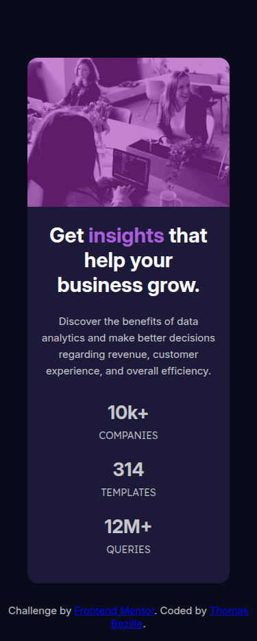

# FrontEnd-Mentor: Stats preview card component

> Stats Preview Card Component - Challenge Frontend Mentor. Carte de statistiques moderne et responsive réalisée avec HTML5 et CSS3. Idéal pour progresser en frontend.

**🔗 [Demo en ligne](https://front-end-mentor-stats-preview-card-vert.vercel.app/)**

---

## 🎯 Objectif

Cette exercice permet de consolider les bases de HTML et de CSS.

**Ce que j'ai appris :**

- Les layouts adaptatif avec Flexbox
- Les filtres sur une image
- L'approche mobile-first

---

## 🛠️ Stack

---

## 👤 Contact

**Thomas Bezille** — Développeur web à Nantes

